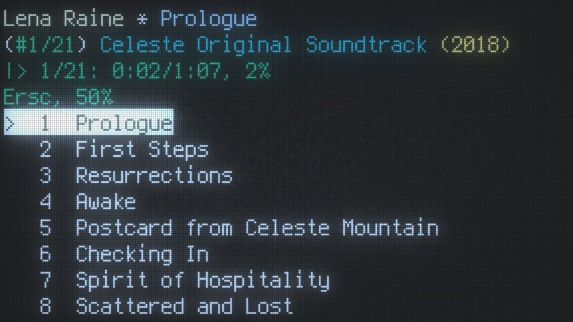
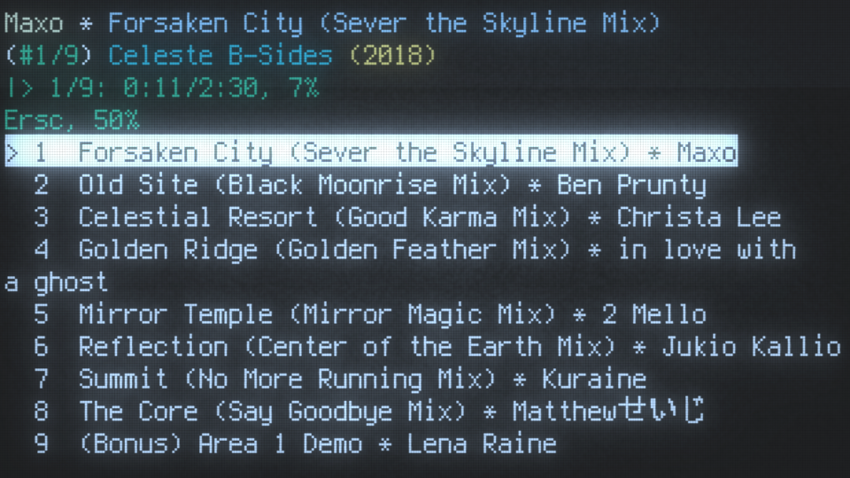

# mpc-display-rs
This is a client for Music Player Daemon.

`mpc-display-rs` was originally a companion program for `mpc`, but now supports keyboard input to control playback! How exciting... it's finally a real MPD client!

## Controls

* `space` - pause/play

* `M` - stops playback

* `p`/`k`, `n`/`j` - prev/next track

* `=`/`+`/`0`/`)`, `-`/`_`/`9`/`(` - volume up/down

* `h`/`l` - seek back/ahead

* `E`/`R`/`S`/`C` - repeat, random, single, consume

* `F` - shuffle (reorders queue in-place)

* `[`/`{`, `]`/`}` - adjust current track rating

* `x`/`X` - crossfade up/down

## Usage

```
Usage: mpc-display-rs [OPTIONS]

Options:
  -H, --host <HOST>      Connect to server at address <HOST> [default: 127.0.0.1]
  -P, --port <PORT>      Connect to server on port <PORT> [default: 6600]
  -f, --format <FORMAT>  Comma-separated list of song metadata to display [default: title,artist,album]
  -t, --title            Equivalent to '--format title'
  -h, --help             Print help
  -V, --version          Print version
```

`mpc-display-rs` respects `MPD_HOST` and `MPD_PORT`.

## Screenshots
<!---->


