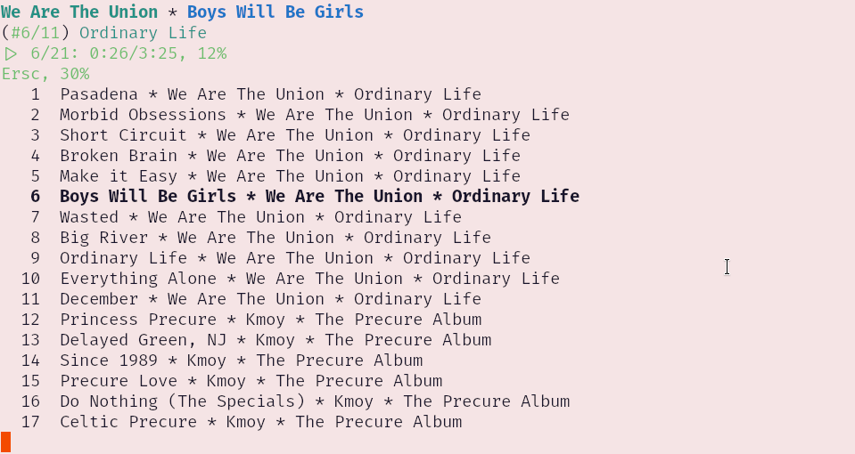

# mpc-display-rs
This is a program that displays the current state of an MPD server.

`mpc-display-rs` is a companion program for the standard client, `mpc`, and does not offer any control whatsoever. It handles text wrapping and is flicker-free, and tries to keep the current track in the center of the screen.

## Screenshots

